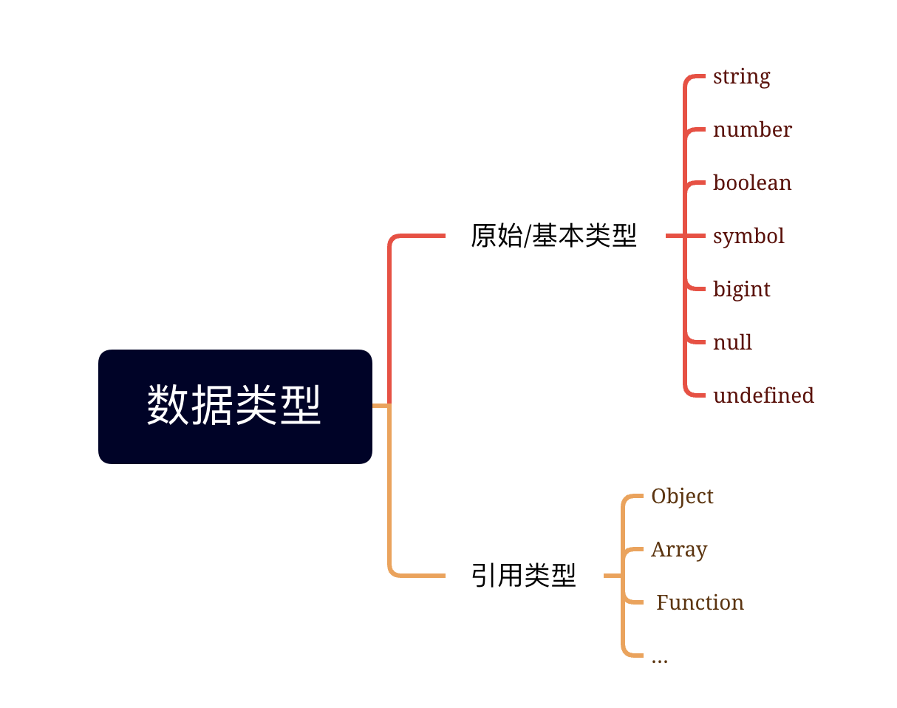
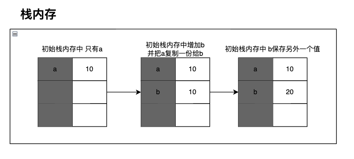
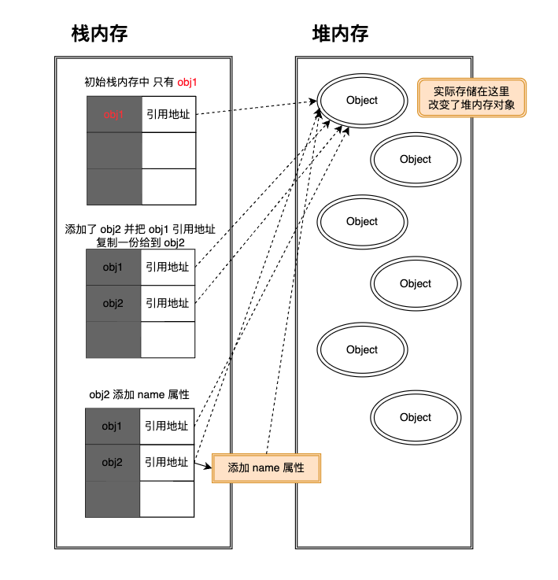

[web前端面试](https://vue3js.cn/interview/JavaScript/data_type.html#%E4%BA%8C%E3%80%81%E5%BC%95%E7%94%A8%E7%B1%BB%E5%9E%8B)



## 原始类型/基本类型

原始类型存储的都是值，是没有函数可以调用的，如<span class="e-1">undefined.toString()</span>

但为什么<span class="e-1">'1'.toString();</span>可以使用？其实在这种情况下，<span class="e-1">'1'</span>已经被强制转换成了<span class="e-1">String</span>类的实例对象，也就是对象类型。所以可以调用<span class="e-1">String</span>类的所有方法。

```js
let a = 'a'.toUpperCase();
console.log(a); // 输出 'A'

// 等价于

let a = new String('a');
console.log(a.toUpperCase()); // 输出 'A'
```

<span class="e-1">string</span>类型的值是不可变的，无论你在<span class="e-1">string</span>类型上调用何种方法，都不会对值有所改变。

### Symbol

<span class="e-1">Symbol(符号)</span>是原始值，且符号实例是<span class="e-1">唯一、不可变的</span>。符号的用途是确保对象属性使用唯一标识符，不会发生属性冲突的危险。

```js
let genericSymbol = Symbol();
let otherGenericSymbol = Symbol();
console.log(genericSymbol == otherGenericSymbol); // false

let fooSymbol = Symbol('foo');
let otherFooSymbol = Symbol('foo');
console.log(fooSymbol == otherFooSymbol); // false
```

## 引用类型

复杂类型统称为<span class="e-1">Object</span>，万物皆对象

- Object
- Array
- Function
- Date、RegExp、Map、Set等

### Object

创建<span class="e-1">Object</span>常用方式为对象字面量表示法，属性名可以是字符串或数值

```js
let person = {
  name: "Tom",
  "age": 18,
  5: true
}
```
### Function

函数实际上是对象，每个函数都是<span class="e-1">Function</span>类的实例，而<span class="e-1">Function</span>也有属性和方法，跟其他引用类型一样。

函数存在三种常见的表达方式:

```js
// **函数声明**
function sum(num1, num2) {
  return num1 + num2;
}

// **函数表达式**
let sum = function(num1, num2) {
  return num1 + num2;
}

// **箭头函数**
let sum = (num1, num2) => {
  return num1 + num2;
}
```

## 存储区别

<span class="e-1">基本数据类型</span>和<span class="e-1">引用数据类型</span>存储在内存中的位置不同:

- 基本类型存储在<span class="e-1">栈</span>中
- 引用类型的对象存储在<span class="e-1">堆</span>中

::: details 堆与栈是什么？区别是什么？
在计算机科学中，堆和栈都是用于在程序运行时存储数据的数据结构，它们的主要区别在于<span class="e-1">它们的内存分配方式和数据访问方式</span>。

堆是一种内存池，它可以在程序运行时动态地分配和释放内存，以存储不同类型的数据，如对象、数组、字符串等。在内存中，堆是没有固定的顺序的，数据在堆中的分配和释放顺序是由程序来控制的，所以堆通常用于存储动态分配的数据结构，如链表、树等。

栈是一种<span class="e-1">后进先出</span>的数据结构，它用于存储程序运行时使用的局部变量、函数参数等。在内存中，栈是有固定顺序的，数据的分配和释放顺序是由编译器来控制的。当程序在运行时调用函数时，编译器会为该函数分配一块栈空间，用于存储函数的参数、局部变量等。当函数调用结束后，这个栈空间会被自动释放，以供其他函数使用。

因此，堆和栈的主要区别在于它们的内存分配方式和数据访问方式。堆是动态分配的，数据的分配和释放由程序来控制，访问是通过指针进行的。栈是静态分配的，数据的分配和释放由编译器来控制，访问是通过函数调用栈来实现的。
:::

当我们把变量赋值给一个变量时，解析器首先要确认的就是这个值时`基本类型`还是`引用类型`

### 基本类型

```js
let a = 10;
let b = a;
b = 20;
console.log(a); // 输出 10
```

<span class="e-1">a</span>的值为一个基本类型，是存储在栈中，将<span class="e-1">a</span>的值，赋值给<span class="e-1">b</span>，虽然两个变量的值相等，但是两个变量保存了两个不同的内存地址



### 引用类型

```js
var obj1 = {};
var obj2 = obj1;
obj2.name = 'Tom';
console.log(obj1.name); // 输出: Tom
```

引用类型数据存放在堆中，每个堆内存对象都有对应的引用地址指向它，引用地址存放在栈中。

<span class="e-1">obj1</span>是一个引用类型，在赋值操作过程汇总，实际是将堆内存对象在栈内存的引用地址复制一份给到<span class="e-1">obj2</span>，实际上它们共同指向了同一个堆内存对象，所以更改<span class="e-1">obj2</span>会对<span class="e-1">obj1</span>产生影响。



**小结**

- 声明变量时的内存地址分配:
  - 基本类型的值存放在栈中，在栈中存放的是对应的值
  - 引用类型的值存放在堆中，在栈中存放的是指向堆内存的地址
- 赋值变量时的不同
  - 基本类型赋值：生成相同的值，两个对象对应不同的栈空间
  - 引用类型赋值：将保存对象的内存地址复制给另一个变量。就是两个变量指向堆内存中同一个对象