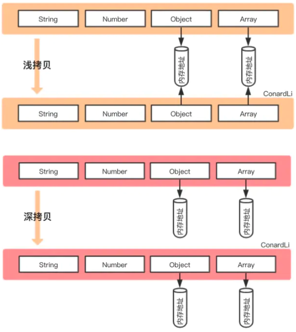

## 资料

- [数据类型](./base_type.md)

## 浅拷贝

浅拷贝，指的是创建新的数据，这个数据有着原始数据属性指的一份精确拷贝。

对象的赋值通常是浅拷贝，即两个对象引用了同一个内存地址，当其中一个对象发生改变时，另一个对象也会受到影响。

- 基本类型：拷贝的是基本类型的值
- 引用类型：拷贝的是内存地址

浅拷贝代码：

```js
function shallowClone(obj) {
  const newObj = {};
  for(let prop in obj) {
    if (obj.hasOwnProperty(prop)) {
      newObk[prop] = obj[prop];
    }
  }
  return newObj;
}
```

在<span class="e-1">Javascript</span>中，存在浅拷贝的现象有：

- 对象赋值
- `Object.assign()`
- `Array.prototype.slice()`
- `Array.prototype.concat()`
- 拓展运算符实现的复制

**Object.assign**

```js
var obj = {
    age: 18,
    nature: ['smart', 'good'],
    names: {
        name1: 'fx',
        name2: 'xka'
    },
    love: function () {
        console.log('fx is a great girl')
    }
}
var newObj = Object.assign({}, fxObj);
```

**Array.prototype.slice**

```js
const fxArr = ["One", "Two", "Three"]
const fxArrs = fxArr.slice(0)
fxArrs[1] = "love";
console.log(fxArr) // ["One", "Two", "Three"]
console.log(fxArrs) // ["One", "love", "Three"]
```

**Array.prototype.concat**

```js
const fxArr = ["One", "Two", "Three"]
const fxArrs = fxArr.concat()
fxArrs[1] = "love";
console.log(fxArr) // ["One", "Two", "Three"]
console.log(fxArrs) // ["One", "love", "Three"]
```

**拓展运算符实现的复制**

```js
const fxArr = ["One", "Two", "Three"]
const fxArrs = [...fxArr]
fxArrs[1] = "love";
console.log(fxArr) // ["One", "Two", "Three"]
console.log(fxArrs) // ["One", "love", "Three"]
```


## 深拷贝

深拷贝是完全复制一个对象，两个对象的内存地址是不同的，修改其中一个对象不会对另一个对象产生影响。

常见的深拷贝方式:

- loadsh.js 的 `_.cloneDeep()`
- `jQuery.extend()`
- `JSON.stringify()`
- 循环递归

**_.cloneDeep()**

```js
const _ = require('lodash');
const obj1 = {
    a: 1,
    b: { f: { g: 1 } },
    c: [1, 2, 3]
};
const obj2 = _.cloneDeep(obj1);
console.log(obj1.b.f === obj2.b.f); // false
```

**jQuery.extend()**

```js
const $ = require('jquery');
const obj1 = {
    a: 1,
    b: { f: { g: 1 } },
    c: [1, 2, 3]
};
const obj2 = $.extend(true, {}, obj1);
console.log(obj1.b.f === obj2.b.f); // false
```

**JSON.stringify()**

```js
const obj2=JSON.parse(JSON.stringify(obj1));
```

但是这种方式存在弊端，会忽略`undefined`、`symbol`和`函数`

```js
const obj = {
    name: 'A',
    name1: undefined,
    name3: function() {},
    name4:  Symbol('A')
}
const obj2 = JSON.parse(JSON.stringify(obj));
console.log(obj2); // {name: "A"}
```

**循环递归**

```js
function deepClone(obj, hash = new WeakMap()) {
  if (obj === null) return obj; // 如果是null或者undefined我就不进行拷贝操作
  if (obj instanceof Date) return new Date(obj);
  if (obj instanceof RegExp) return new RegExp(obj);
  // 可能是对象或者普通的值  如果是函数的话是不需要深拷贝
  if (typeof obj !== "object") return obj;
  // 是对象的话就要进行深拷贝
  if (hash.get(obj)) return hash.get(obj);
  let cloneObj = new obj.constructor();
  // 找到的是所属类原型上的constructor,而原型上的 constructor指向的是当前类本身
  hash.set(obj, cloneObj);
  for (let key in obj) {
    if (obj.hasOwnProperty(key)) {
      // 实现一个递归拷贝
      cloneObj[key] = deepClone(obj[key], hash);
    }
  }
  return cloneObj;
}


function deepClone(obj) {
  let clone = Array.isArray(obj) ? [] : {};

  if (obj && typeof obj === "object") {
    for (let key in obj) {
      if (obj.hasOwnProperty(key)) {
        // 递归调用deepClone函数
        clone[key] = deepClone(obj[key]);
      }
    }
  } else {
    clone = obj;
  }
  return clone;
}
```

## 区别



浅拷贝与深拷贝都创建出一个新的对象，但在复制对象属性的时候，行为不一样。

浅拷贝只复制属性指向某个对象的指针(堆内存地址)，而不复制对象本身，新旧对象都是共享同一块内存，修改对象属性会影响到原对象。

```js
// 浅拷贝
const obj1 = {
    name : 'init',
    arr : [1,[2,3],4],
};
const obj3=shallowClone(obj1) // 一个浅拷贝方法
obj3.name = "update";
obj3.arr[1] = [5,6,7] ; // 新旧对象还是共享同一块内存

console.log('obj1',obj1) // obj1 { name: 'init',  arr: [ 1, [ 5, 6, 7 ], 4 ] }
console.log('obj3',obj3) // obj3 { name: 'update', arr: [ 1, [ 5, 6, 7 ], 4 ] }
```

深拷贝会创建一个一摸一样的对象，在堆内存中开辟出一个新的内存空间，新对象与旧对象不共享内存，修改对象不会影响到原对象。

```js
// 深拷贝
const obj1 = {
    name : 'init',
    arr : [1,[2,3],4],
};
const obj4=deepClone(obj1) // 一个深拷贝方法
obj4.name = "update";
obj4.arr[1] = [5,6,7] ; // 新对象跟原对象不共享内存

console.log('obj1',obj1) // obj1 { name: 'init', arr: [ 1, [ 2, 3 ], 4 ] }
console.log('obj4',obj4) // obj4 { name: 'update', arr: [ 1, [ 5, 6, 7 ], 4 ] }
```

## 小结

- 浅拷贝: 两个对象指向同一个内存地址
- 深拷贝：两个对象指向各自的内存地址，互不相干