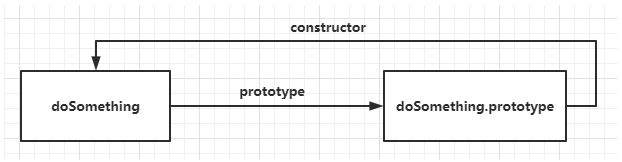

## 原型

`Javascript`常被描述为一种基于原型的语言，每个对象都拥有一个<span class="e-1">原型对象</span>，即它的父级对象。

当试图访问一个对象的属性时，它不仅仅在该对象上搜寻，还会搜寻该对象的原型，以及该对象的原型的原型，依次层层向上搜索，直到找到一个名字匹配的属性或到达原型链的末尾。

准确地说，这些属性和方法定义在`Object`的构造函数(constructor functions)之上的<span class="e-1">prototype</span>属性上，而非实例对象本身。

例子:
```js
function doSomething(){}
console.log( doSomething.prototype );

// 输出
{
  constructor: ƒ doSomething(),
  __proto__: {
      constructor: ƒ Object(),
      hasOwnProperty: ƒ hasOwnProperty(),
      isPrototypeOf: ƒ isPrototypeOf(),
      propertyIsEnumerable: ƒ propertyIsEnumerable(),
      toLocaleString: ƒ toLocaleString(),
      toString: ƒ toString(),
      valueOf: ƒ valueOf()
  }
}
```

可以看到，原型对象有一个自有属性<span class="e-1">constructor</span>，这个属性指向该函数，如下图关系展示



### 原型对象

原型对象也是一个普通的`Javascript`对象，它拥有自己的原型和属性和方法。例如，在我们创建一个构造函数时，它会具有一个名为 prototype 的属性，该属性指向一个对象，它包含了构造函数共享的属性和方法。通过在原型对象上定义属性和方法，所有由该构造函数创建的对象都会具有这些属性和方法，实现了代码的重用

## 原型链

原型链是基于原型实现的继承方式，它是一种链式结构，它由多个对象的原型组成，每个对象的原型又指向其父对象的原型，直到最终指向<span class="e-1">Object.prototype</span>，形成了一个链式的结构，这就是原型链。

在对象实例和它的构造器之间建立一个连接(它是<span class="e-1">\_\_proto\_\_</span>属性，是从构造函数的<span class="e-1">prototype</span>属性派生的)，之后通过上溯原型链，在构造器中找到这些属性和方法

```js
function Person(name) {
    this.name = name;
    this.age = 18;
    this.sayName = function() {
        console.log(this.name);
    }
}
// 第二步 创建实例
var person = new Person('person')
```

图示：


- 构造函数<span class="e-1">Person</span>存在原型对象<span class="e-1">Person.prototype</span>
- 构造函数生成实例对象<span class="e-1">person</span>，<span class="e-1">person</span>的<span class="e-1">\_\_proto\_\_</span>指向构造函数<span class="e-1">Person</span>原型对象
- <span class="e-1">Person.prototype.__proto__</span>指向内置对象，因为<span class="e-1">Person.prototype</span>是个对象，默认是由<span class="e-1">Object</span>函数作为类创建的，而<span class="e-1">Object.prototype</span>为内置对象。
- <span class="e-1">Person.\_\_proto\_\_</span>指向内置匿名函数<span class="e-1">anonymous</span>，因为<span class="e-1">Person</span>是个函数对象，默认由<span class="e-1">Function</span>作为类创建
- <span class="e-1">Function.prototype</span>和<span class="e-1">Function.__proto__</span>同时指向内置匿名函数<span class="e-1">anonymous</span>，这样原型链的终点就是<span class="e-1">null</span>

## 总结

下面要看几个重要的概念：

<span class="e-1">\_\_proto\_\_</span>作为不同对象之间的桥梁，用来指向创建它的构造函数的原型对象


每个对象的<span class="e-1">\_\_proto\_\_</span>都是指向它的构造函数的原型对象<span class="e-1">prototype</span>

```js
person1.__proto__ === Person.prototype
```

构造函数是一个函数对象，是通过<span class="e-1">Function</span>构造器产生的

```js
Person.__proto__ === Function.prototype
```

原型对象本身是一个普通对象，而普通对象的构造函数都是<span class="e-1">Object</span>

```js
Person.prototype.__proto__ === Object.prototype
```

所有的构造器都是函数对象，函数对象都是<span class="e-1">Function</span>构造产生的

```js
Object.__proto__ === Function.prototype
```

<span class="e-1">Object</span>的原型对象也有<span class="e-1">\_\_proto\_\_</span>属性指向<span class="e-1">null</span>,<span class="e-1">null</span>是原型链的顶端

```js
Object.prototype.__proto__ === null
```

下面作出总结：

- 一切对象都是继承自<span class="e-1">Object</span>对象，<span class="e-1">Object</span>对象直接继承根对象<span class="e-1">null</span>
- 一切的函数对象(包括<span class="e-1">Object</span>对象)，都是继承自<span class="e-1">Function</span>对象
- <span class="e-1">Object</span>对象直接继承自<span class="e-1">Function</span>对象
- <span class="e-1">Function</span>对象的<span class="e-1">\_\_proto\_\_</span>会指向自己的原型对象，最终还是继承自<span class="e-1">Object</span>对象