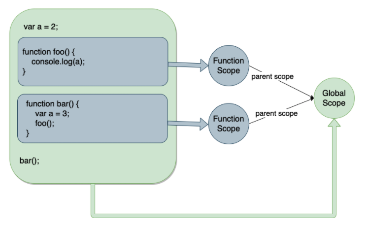

## 作用域

作用域，字面上的意思就是产生作用的区域。在`Javascript`中作用域指的是<span class="e-1">变量</span>和<span class="e-1">函数</span>的<span class="e-1">可访问范围</span>，即在那个代码块中可以读取或者修改变量。

我们一般把作用域分为：

- 全局作用域
- 函数作用域
- 块级作用域(ES6中<span class="e-1">let</span>与<span class="e-1">const</span>)

### 全局作用域

任何不在函数中或是花括号`{}`中声明的变量，都是在全局作用域下。

全用作用域下声明的变量可以在程序的任意位置访问。

```js
// 全局变量
var greeting = 'Hello World!';
function greet() {
  console.log(greeting);
}
// 打印 'Hello World!'
greet();

// 无视文件
<script src="a.js"></script> // var a = "hello";
<script src="b.js"></script> // var b = "world!";
<script>
  console.log(a); // 输出 hello
  console.log(b); // 输出 world!
</script>
```

### 函数作用域

函数作用域也叫局部作用域，局部作用域是指定义在函数或者代码块中的变量和函数，它们只能在函数或者代码块内部被访问，不能在函数或者代码块外部被访问。

```js
function greet() {
  var greeting = 'Hello World!';
  console.log(greeting);
}
// 打印 'Hello World!'
greet();
// 报错： Uncaught ReferenceError: greeting is not defined
console.log(greeting);
```

### 块级作用域

在 ES6 中，引入了<span class="e-1">let</span>和<span class="e-1">const</span>关键字，可以定义块级作用域。块级作用域指的是花括号<span class="e-1">{}</span>包裹的代码块中定义的变量和函数，它们只能在该代码块中被访问，代码块外部无法访问

```js
{
  // 块级作用域中的变量
  let greeting = 'Hello World!';
  var lang = 'English';
  console.log(greeting); // Prints 'Hello World!'
}
// 变量 'English'
console.log(lang);
// 报错：Uncaught ReferenceError: greeting is not defined
console.log(greeting);
```

## 词法作用域

`JavaScript` 中的作用域遵循词法作用域规则，又叫静态作用域，即变量或函数在<span class="e-1">声明时就确定了其作用域</span>。在函数中定义的变量默认是局部变量，它只在函数内部生效，如果要在函数外部使用该变量，需要使用 return 返回值或者将变量赋值给全局变量。

```js
var a = 2;
function foo(){
    console.log(a)
}
function bar(){
    var a = 3;
    foo();
}
bar()

// 输出 2
```



由于`Javascript`遵循词法作用域，相同层级的`foo`和`bar`就没有办法访问到彼此块作用域中的变量，所以输出2

## 作用域链

`Javascript`中的作用域链(Scope Chain)是指变量的查找机制。

作用域链由多个执行上下文(Execution Context)的变量对象(Variable Object)组成的链式结构，表示当前执行环境中所有可访问的变量和函数。

::: details 执行上下文栈(Execution Context Stack)
当 JavaScript 引擎执行代码时，会创建一个执行上下文栈（Execution Context Stack），每当进入一个函数执行时，就会创建一个新的执行上下文并推入栈顶，当函数执行完毕后，就会将该执行上下文弹出栈顶，继续执行上一个执行上下文中的代码。每个执行上下文都包含了一个变量对象（Variable Object），用于保存当前执行环境中的变量和函数，同时还会从它所在的外部执行上下文中获取变量和函数，形成一个链式结构，这就是作用域链。 
 
作用域链的查找顺序是从当前执行上下文的变量对象开始查找，如果没有找到，则从外部执行上下文的变量对象中查找，如果还没有找到，就继续往外部查找，直到查找到全局执行上下文为止。如果最终还没有找到，则会抛出“ReferenceError”错误。
:::