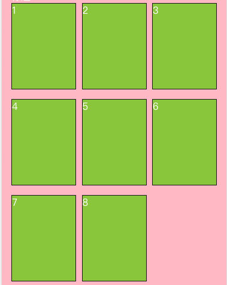

## flex 子元素宽度无效

``` css
.child {
  flex: 0 0 auto;
}
```

## justify-content布局最后一行对齐方式



::: tip
思路: 计算剩余空间给最后的子元素设置左右边距
:::

这里选择了最后一个元素并且是第二个，因为这里是3列的布局只计算一个，如果是多列就要计算多个

``` css {16-20}
.container-2row-3col {
  width: 100%;
  display: flex;
  justify-content: space-between;
  flex-wrap: wrap;

  .c-item {
    width: px2(216px);
    height: px2(288px);
    margin-bottom: px2(32px);
    border: px2(2px) solid #181818;
    box-sizing: border-box;
    background: yellowgreen;
  }

  /* This */
  .c-item:last-child:nth-child(3n - 1) {
    margin-left: calc((100% - (px2(216px) * 3)) / 2);
    margin-right: auto;
  }
}
```

### 参考
- [Flex 布局教程：语法篇](https://www.ruanyifeng.com/blog/2015/07/flex-grammar.html)
- [让CSS flex布局最后一行列表左对齐的N种方法](https://www.zhangxinxu.com/wordpress/2019/08/css-flex-last-align/)
- [父元素display:flex布局下的子元素宽度无效问题](https://blog.csdn.net/weixin_40365953/article/details/83895848)